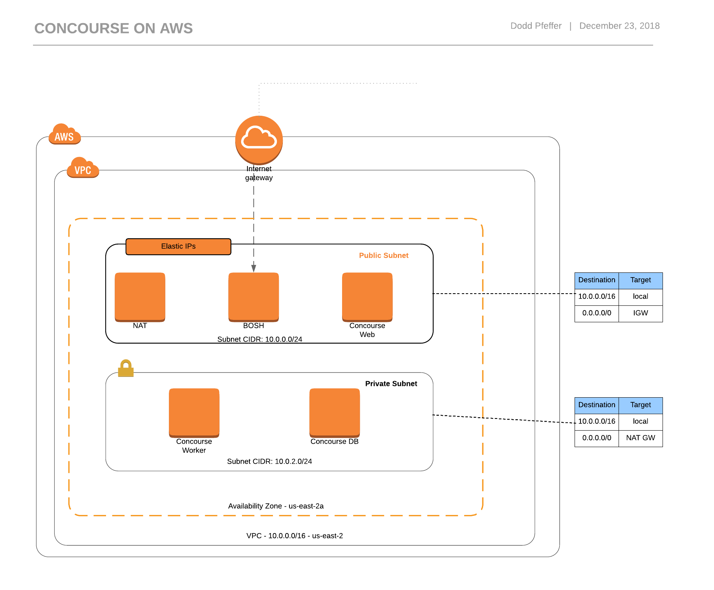

# Concourse Installation at AWS

The following guide walks through setting up Concourse for PCF on Aws.  This is for demo and sandbox activities only and does not represent a production ready implementation. The following Pivotal documentation drove this effort: https://docs.pivotal.io/p-concourse/installing.html
The process should take about 30 minutes.



## Setup

Get the supported credhub version from [Concourse for PCF docs](https://docs.pivotal.io/p-concourse/4-x/index.html#compatibility)

>NOTE: Update the tag version in ./scripts/clone-source-git-repos.sh

```bash
./scripts/clone-source-git-repos.sh
```

## Pave IaaS

1. Terraform apply: change directory to terraforming-concourse and then `terraform apply`
2. Update with output variables
    - bosh_ip
        - update vars/bosh-director-params.yml
    - concourse_ip
        - update vars/concourse_params.yml
        - update godady dns for ci.aws.winterfell.live
    - public_subnet_id
        - update vars/bosh-director-params.yml
        - update bosh/cloud.yml (concourse network)
    - private_subnet_id
        <!-- - update vars/bosh-director-params.yml I don't think this is necessary -->
        - update bosh/cloud.yml

## Bosh Director Installation

First you need to setup a dedicated BOSH director for Concourse.  The following steps were guided by http://bosh.io/docs/init-aws/.

1. Create the bosh environment

You will need to update the variables passed in below with the ones provided by your environment

```bash
export ACCESS_KEY_ID=<get from ../credentails.csv>
export SECRET_ACCESS_KEY=<get from ../credentails.csv>
./scripts/create-bosh.sh $ACCESS_KEY_ID $SECRET_ACCESS_KEY
```

>Example ./scripts/create-bosh.sh asdfasdfasdf adsfasdfasdfadf

1. Setup alias and update the cloud config

>NOTE!!!!!!!  Make use you update the cloud.yml file with your subnet in AWS

```bash
./scripts/configure-bosh.sh
```

## Concourse Installation

Now you are ready for the concourse installation.

1. Use Pivnet to retrieve stemcells and then upload into bosh

Log into Pivnet
Download stemcell **may have to update release version and identifier**
>See [Concourse Compatibility](https://docs.pivotal.io/p-concourse/index.html#compatibility) for supported stemcells

Your token may be found at ~/.pivnetrc

Get the supported XENIAL_VERSION from [Concourse for PCF docs](https://docs.pivotal.io/p-concourse/4-x/index.html#compatibility)

```bash
./scripts/retrieve-and-upload-stemcell.sh $PIVNET_API_TOKEN $XENIAL_VERSION $XENIAL_SLUG
```

>Example `./scripts/retrieve-and-upload-stemcell.sh $PIVNET_API_TOKEN 250.29 352497`

1. Deploy Concourse

Get the supported credhub version from [Concourse for PCF docs](https://docs.pivotal.io/p-concourse/4-x/index.html#compatibility)

>NOTE: Update the tag version in ./scripts/clone-source-git-repos.sh

Check that you have the right versions of concourse, postgres, uaa, and garden_runc while you are at it

Update the variables with specifics from your environment

Helpful guides:

- [For use of oauth and uuaa](https://github.com/concourse/concourse-bosh-deployment/pull/85)
- [For credhub and concourse integration](https://github.com/pivotal-cf/pcf-pipelines/blob/master/docs/credhub-integration.md)

For a uaa/credhub solution...

```bash
./scripts/deploy-concourse.sh
```

>If there are issues, you can [ssh into the servers using bosh director as a jumpbox](https://bosh.io/docs/jumpbox/)...

```bash
bosh int generated/bosh/creds.yml --path /jumpbox_ssh/private_key > generated/bosh/jumpbox.key
chmod 600  generated/bosh/jumpbox.key
bosh alias-env bosh-concourse-aws -e $BOSH_IP --ca-cert <(bosh int generated/bosh/creds.yml --path /director_ssl/ca)
bosh -e bosh-concourse-aws vms
bosh -e bosh-concourse-aws -d concourse ssh $VM_FROM_PREVIOUS_COMMAND  --gw-host=$BOSH_IP --gw-user jumpbox --gw-private-key generated/bosh/jumpbox.key
```

1. Create concourse user

```bash
./scripts/create-concourse-user.sh $CONCOURSE_HOST $CONCOURSE_USER $CONCOURSE_USER_PASSWORD
```

>Example: `./scripts/create-concourse-user.sh ci.aws.winterfell.live concourse PasswOrd`

1. Test access

```bash
fly login -t aws -c https://ci.aws.winterfell.live -k

fly -t aws set-team -n team-uaa-oauth --oauth-user concourse --non-interactive

credhub api https://ci.aws.winterfell.live:8844 --ca-cert <(bosh int generated/concourse/concourse-gen-vars.yml --path /atc_tls/ca)

export CREDHUB_PASSWORD=$(bosh int generated/concourse/concourse-gen-vars.yml --path /uaa_users_admin)

credhub login -u admin -p "$CREDHUB_PASSWORD"

credhub set --type value --name '/concourse/main/hello' --value 'World'

fly -t aws set-pipeline -p hello-credhub -c test-pipeline/pipeline.yaml -n

fly -t aws unpause-pipeline -p hello-credhub

fly -t aws trigger-job -j hello-credhub/hello-credhub -w

```

## Possible Next Steps

1. Update concourse files to only make custom replacements from the core options
2. Add generation of key pair within concourse scripts
3. Add setup scripts
4. Add tear down scripts